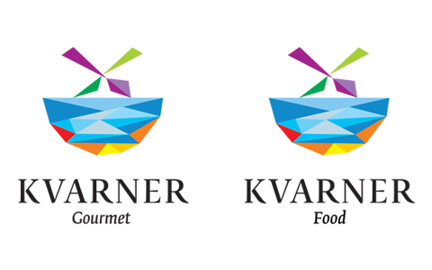
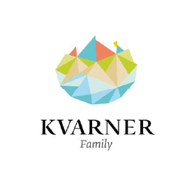

La regione del Quarnaro si estende lungo l'Adriatico settentrionale, su un'area caratterizzata dalla presenza di isole, costa, entroterra e monti, il tutto nell'arco di circa 100 km. Per questo motivo il nostro slogan è "La diversità è bella".

Il centro della regione è la città di Rijeka, nel 2020 Capitale europea della cultura, diventerà una destinazione da non perdere. Gli insediamenti che circondano Rijeka e quelli sulle isole sono le destinazioni vacanze preferite da molti visitatori, e molte di queste lo sono da oltre 150 anni. 

Tutte le quattro isole più grandi e più note tra i turisti - Krk, Rab, Cres e Lošinj - offrono contenuti interessati da esplorare in tanti modi diversi. Gite in barca fino a spiagge nascoste ed escursioni emozionanti in bici che solcano l'interno sono solo alcune delle tante possibilità a disposizione, che a seconda dei desideri del visitatore offrono viaggi relax o avventura.  Oltre alle isole appena menzionate, ci sono tante isole più piccole, splendide mete per escursioni giornaliere. 

##La cultura della regione del Quarnaro

Oltre che da isole e spiagge, la regione del Quarnaro è caratterizzata anche da un territorio collinoso e montano fatto di parchi naturali, il Parco naturale del Risnjak, ma anche da un patrimonio culturale importante, tra cui il percorso culturale 'Sulle tracce dei Frankopan'.

Da autentici castelli di montagna fino alle fortezze situate lungo la costa, questo percorso permette di visitare ciò che in passato apparteneva ai Frankopan, un'importante famiglia di nobili della regione del Quarnaro. Si tratta di 20 splendidi edifici, tra cui rovine romantiche, castelli ancora ben conservati, monasteri e conventi, situati in un ambiente meraviglioso fatto di mare e montagna.

Il primo possedimento dei Frankopan si trova a Gradec, vicino a Vrbnik sull'isola di Krk. Oggi, i resti di questo piccolo castello si trovano in una fitta foresta e raggiungerli sarà una vera sfida per gli amanti della natura.

Il monastero dei francescani situato sulla splendida isola boscosa di Košljun è un esempio degli investimenti nella cultura da parte dei Frankopan, tanto che alcuni dei pittori veneziani più importanti dell'epoca realizzarono l'attrezzatura per la piccola, ma importante chiesa del monastero francescano. 

Il castello dei Frankopan nella città di Krk offre un panorama indimenticabile sul mare, anche se si deve sottolineare che a Krk è possibile godere della spiaggia e del mare con una vista unica sul patrimonio dei conti di Krk.

Durante una vista alla città di Rijeka è d'obbligo visitare il castello di Tersatto. Questo grande castello dei Frankopan era dotato di una straordinaria zona residenziale. All'interno delle mura di cinta ben conservate è possibile ammirare un vero sito archeologico con i resti di vecchie dotazioni di lusso. 

Possiamo menzionare il fatto che da ogni possedimento dei Frankopan emergono dettagli affascinanti scoperti duranti i continui lavori di ristrutturazione delle mura. Così, di recente, presso il castello di Grobnik ottimamente conservato, è stata scoperta una vecchia entrata in una delle torri che era murata e nascosta sotto la facciata. 

Per tutti i viaggiatori interessati ai vecchi abitanti e possidenti della regione del Quarnaro è a disposizione il sito internet frankopani.eu, che offre maggiori informazioni su ogni località lungo questo percorso culturale. Per iniziare il percorso storico alla scoperta dei Frankopan, suggeriamo una visita allo splendido castello di Kraljevica, che ospita un Centro di interpretazione per visitatori.

##Che cosa amavano i Frankopan e che cosa amano oggi gli abitanti del Quarnaro?

I Frankopan vissero e operarono fino alla seconda metà del XVII secolo, quindi il loro stile di vita era molto diverso da quello di oggi. All'epoca, le patate non erano ancora note e non era possibile fare il gelato perché la tecnologa esistente non permetteva il raffreddamento. Tuttavia, avevano molte cose in comune con l'uomo moderno, e cioè l'amore per gli ottimi sapori.

I Frankopan adoravano le spezie e i piatti creativi. Oggi molti ristoranti del Quarnaro offrono piatti creativi a base di carne e pesce o vegetariani. 
Quando si è alla ricerca di un ristorante o taverna basterà solo assicurarsi che siano dotati dei marchi qualità Kvarner Gourmet e Kvarner Food.

    

##Vacanze in famiglia

La regione del Quarnaro è l'ideale per tutti i tipi di vacanze in famiglia, escursioni o gite nei fine settimana. Kvarner Family è un marchio che raccoglie una collezione di alloggi di alta qualità rivolti alle famiglie e che si trovano in tutta la regione. La regione dispone anche di numerosi hotel per famiglie. Per molti visitatori invece sarà importante avere un alloggio con il marchio Pet Friendly. Oggi, un numero sempre più elevato di strutture, ma anche di spiagge attrezzate rivolte agli ospiti con animali, porta questo marchio.

Possiamo concludere che la regione del Quarnaro offre un'ampia varietà di possibilità per tutti i tipi di ospiti che nel corso dell'anno avranno bisogno di riposo, avventura, esplorazione ed esperienze all'insegna dell'ispirazione.

Scarica il volantino con tutte le località da visitare...

    

