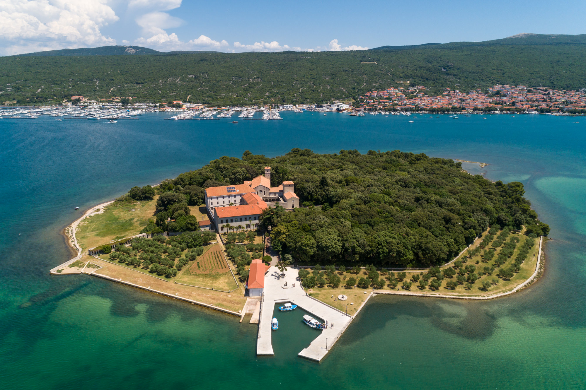
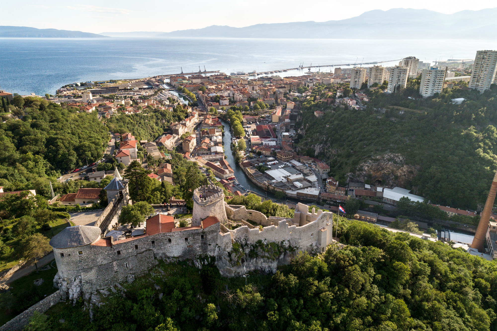
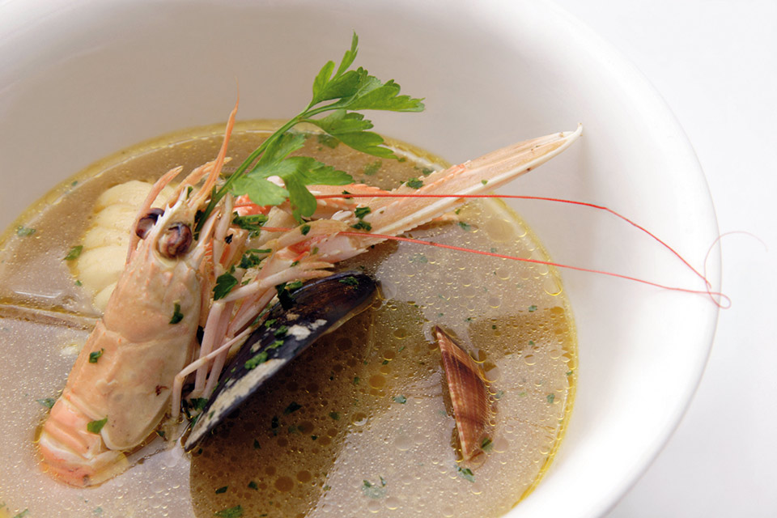
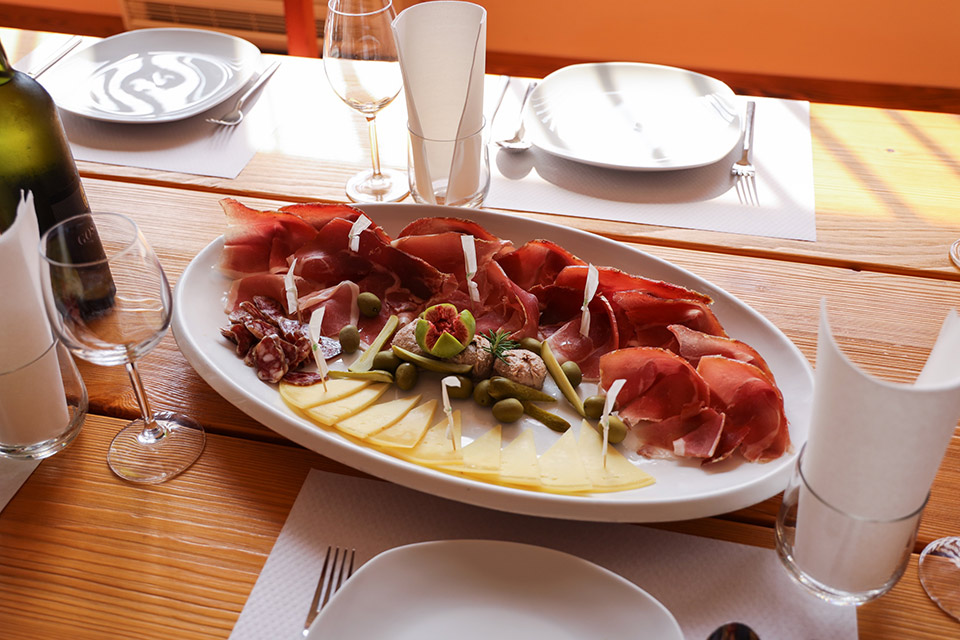
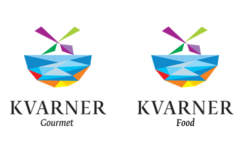
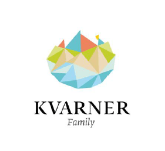
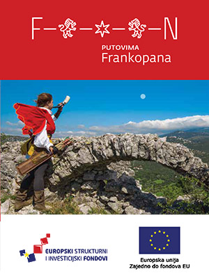

Die Kvarner-Region umfasst das abwechslungsreiche Gebiet der nördlichen Adria, von den Inseln und der Küste über das Hinterland bis hin zu Bergen, und all das in einem Umkreis von rund 100 Kilometern. Deshalb lautet unser Motto: „Vielfalt ist schön.“

Das Zentrum der Region ist die Stadt Rijeka, die im kommenden Jahr 2020 Kulturhauptstadt Europas und damit zu einem äußerst sehenswerten Reiseziel wird. Die Ortschaften rund um Rijeka und auf den Inseln sind ein beliebtes Sommerreiseziel für zahlreiche Urlauber, einige davon bereits seit mehr als 150 Jahren. 

Auf jeder der vier bekanntesten und größten Inseln – Krk, Rab, Cres und Lošinj – kann man interessante Dinge entdecken, die auf unterschiedlichste Weise erkundet werden können. Bootsfahrten zu einsamen, verborgenen Stränden sowie aufregende Radtouren durch das Innere der Inseln sind nur einige der Möglichkeiten, je nachdem, ob der Besucher einen entspannten oder einen Abenteuerausflug bevorzugt.  Zusätzlich zu den genannten Inseln gibt es zahlreiche kleinere Inseln, die ideale Ziele für Tagesausflüge sind. 

##Die Kultur der Kvarner-Region

Neben der Küste und den Stränden bietet die Kvarner-Region auch ein mit Naturparks geschmücktes Hügel- und Bergland, den Risnjak-Nationalpark, aber auch einen Teil des wichtigsten Kulturerbes der Kvarner-Region – die Kulturroute Auf den Wegen der Frankopans.

Von authentischen Gebirgsburgen bis hin zu Festungen am Meer führt diese Route durch das Gebiet, welches einst der wichtigsten Adelsfamilie der Kvarner-Region gehörte – den Frankopans. Es handelt sich um 20 beeindruckende Gebäude, darunter romantische Ruinen, gut erhaltene Schlösser, einige Klöster und ein orthodoxes Kloster, eingebettet in eine unwiderstehliche Kulisse aus Bergen und Meer.

Das erste Anwesen der Frankopans war Gradec in der Nähe des Ortes Vrbnik auf der Insel Krk. Die Überreste dieses kleinen Schlosses liegen heute tief im Wald verborgen, und deren Erkundung ist eine echte Herausforderung für Naturliebhaber.

Das Franziskanerkloster auf dem wunderschönen, bewaldeten Inselchen Košljun ist ein Beispiel für die Investitionen der Frankopans in die Kunst ihrer Zeit, sodass einige der bedeutendsten venezianischen Maler die Ausstattung für die kleine, aber sehr bedeutende Kirche im Franziskanerkloster anfertigten. 

Das Frankopan-Kastell in der Stadt Krk bietet einen unvergesslichen Blick auf das Meer. Sie können aber auch in Krk den Strand genießen und im Meer baden, mit einem einzigartigen Ausblick auf das Erbe der Fürsten von Krk.

Bei einem Besuch der Stadt Rijeka sollten Sie unbedingt auch die Festung Trsat besuchen. Dieses große Schloss der Frankopans hatte einen besonders eindrucksvollen Wohnbereich. Innerhalb der relativ gut erhaltenen Außenmauern findet man eine wahre archäologische Ausgrabungsstätte der Überreste der ehemaligen prächtigen Ausstattung. 

Besonders erwähnenswert sind die faszinierende Details in jedem Besitz der Frankopans, die sich während der ständigen Arbeiten an der Restaurierung der Mauern zeigen. So wurde im perfekt erhaltenen Schloss Grobnik kürzlich der frühere Eingang zu einem der Türme entdeckt, der lange Zeit unter der Fassade zugemauert und verborgen war. 

Für alle Reisenden, die mehr über die ehemaligen Bewohner und Herrscher der Kvarner-Region erfahren möchten, gibt es eine spezielle Website, frankopani.eu, auf der Sie detaillierte Informationen zu den einzelnen Fundstätten entlang der Kultur-Route finden. Zu Beginn der Erkundung der Route und der Geschichte der Frankopans empfehlen wir einen Besuch im monumentalen Schloss in Kraljevica, in dem sich das Besucherinterpretationszentrum befindet.

##Was gefiel den Frankopans und was mögen die heutigen Bewohner der Kvarner-Region?

Die Frankopans lebten und wirkten bis in die zweite Hälfte des 17. Jahrhunderts, und ihre Lebensweise unterschied sich erheblich von der heutigen. Kartoffeln wurden zu ihrer Zeit noch nicht gegessen und die Herstellung von Eiscreme war nicht möglich, da es an der Technologie mangelte, die eine Kühlung ermöglichte. Es gibt jedoch eine Menge Dinge, die ihnen und den heutigen Menschen gemeinsam sind, so z. B. der Wunsch nach gutem Geschmack.

Die Frankopans liebten Gewürze und kreative Gerichte. Heutzutage bieten viele Restaurants in der Kvarner-Region kreative Gerichte an, von Fisch- über Fleisch- bis hin zu vegetarischen Gerichten. 
Achten Sie bei der Wahl eines Restaurants oder einer Taverne auf die Gütesiegel von Kvarner Gourmet und Kvarner Food.

    

##Familienurlaub

Die Kvarner-Region ist ideal für alle Arten von Familiensommerurlauben, Ferien oder Wochenendausflügen. Das Kvarner Family Logo ist eine Auswahl hochwertiger Familienunterkünfte in der gesamten Region. Darüber hinaus gibt es in der Region eine Vielzahl von familienorientierten Hotels. Bei der Auswahl der Unterkunft ist für viele Besucher die Bezeichnung Kvarner Pet Friendly wichtig, die immer mehr Unterkünfte und immer mehr Strände tragen, die für Gäste mit Haustieren konzipiert und vorgesehen sind.

Das zeigt, dass die Kvarner-Region allen Gästen, die zu jeder Jahreszeit Urlaub, Abenteuer, Entdeckungsreisen und inspirierende Erlebnisse suchen, ein breites Spektrum an Möglichkeiten bietet.

Download brochure...

    

