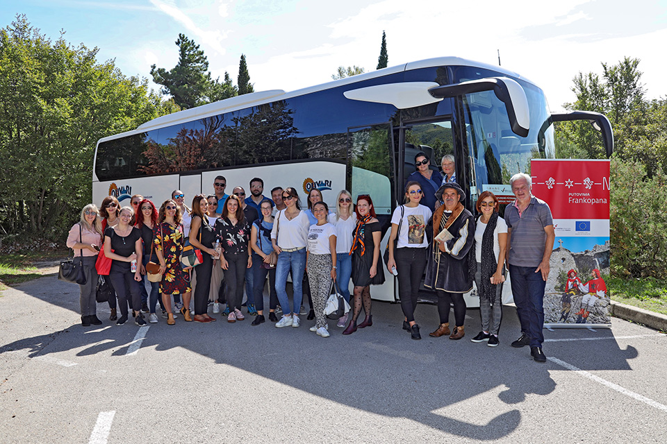
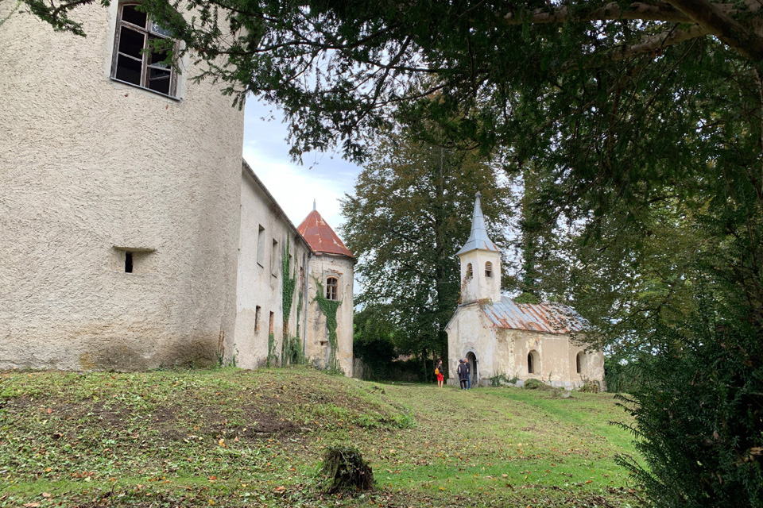
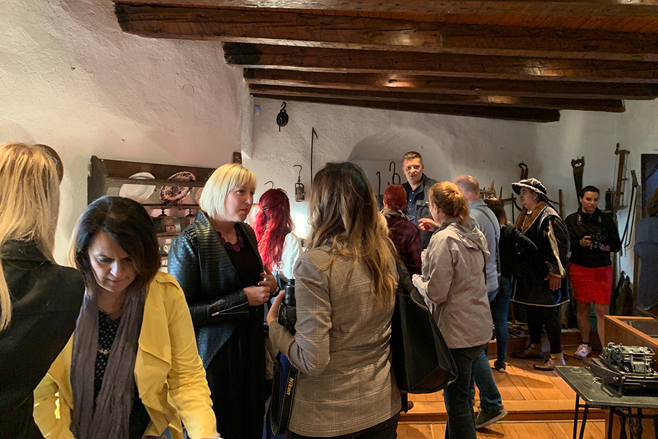
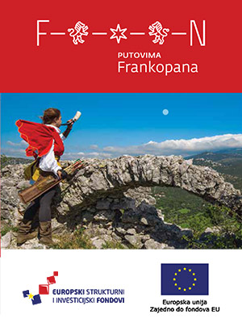

Tridesetak predstavnika medija i turističkih agencija iz Hrvatske, Slovenije, Bosne i Hercegovine i Srbije boravilo je od 23. do 26. rujna 2019. na studijskom putovanju „Putovima Frankopana“. Sudionici su u tri dana posjetili 10 od 20 lokacija uključenih u kulturno-turističku rutu kojom Turistička zajednica Kvarnera želi ponuditi gostima novi turistički doživljaj.

Od Kraljevice, preko otoka Krka, Gorskog kotara i Vinodola do Trsata, zahtjevno je i sadržajno putovanje povezalo kulturnu baštinu nekadašnjih frankopanskih posjeda, uživanje u nevjerojatnim vidicima s frankopanskih zidina i kula, opuštanje u plavetnilu mora i neba i zelenilu gorskih predjela. Nije izostala ni ponuda lokalne kuhinje, autentičnih jela i lokalnih vina i rakija, koja bi sigurno zadovoljila i ukus izbirljivih Frankopana.

<section class="slike-galerija">
    

        
    

    

        
    

        

        
    

</section>

Cijeli program putovanja pratio je i animirao goste knez Mikula IV Frankopan, iz udruge Krčki knezovi Frankopani, sa svojim brojnim plemstvom.

Zahvaljujemo svima koji su nas kao dobri domaćini dočekali, pozdravili i upoznali s frankopanskim nasljeđem svoga kraja. 

Putovanje je započelo u Dvorcu Nova Kraljevica gdje je uz tiskovnu konferenciju upriličen obilazak Interpretacijskog centra. Unutarnje dvorište dvorca bilo je poprište fotografiranja, snimanja i davanja izjava medijima. 

U ime domaćina, prisutnima se obratila zamjenica gradonačelnika Grada Kraljevica Paula Vučković koja je prezentirala ponudu dvorca i ulogu Frankopana u povijesti regije.
Na tiskovnoj su konferenciji sudionike putovanja pozdravile i s projektom detaljno upoznale Sonja Šišić, pročelnica Upravnog odjela za kulturu, sport i tehničku kulturu Primorsko- goranske županije i Irena Peršić- Živadinov, direktorica Turističke zajednice Kvarnera.

Nakon pića dobrodošlice i domjenka koje su pripremili domaćini, Jelena  Mateševac je na kreativan način interpretirala postav u dvorcu, sa zanimljivim detaljima iz života Frankopana u doba kada su vladali Kraljevicom.

<section class="slike-galerija">
    

        
    

    

        
    

    

        
    

    

        
    

</section>

Daljnji put je vodio preko Krčkog mosta, sve do Kuće krčkog pršuta u mjestu Vrh gdje su domaćini, obitelj Žužić, objasnili zašto je njihov nagrađivani pršut toliko dobar i drugačiji od drugih, a u to su se svi prisutni mogli uvjeriti nakon degustacije i tradicionalne krčke maneštrice u kojoj je, naravno, bilo i pršuta. Kao i u domaćem kruhu.

Uslijedio je posjet Gradu Krku i njegovom Frankopanskom kaštelu čije su zidine i pogled oduševili sve prisutne. U ime TZ Grada Krka, goste je pozdravila direktorica Nataša Jurina, a u ime TZ otoka Krka direktorica Majda Šale. Pozornica na trgu Kamplin bila je savršeno mjesto za igranje scena iz Igre prijestolja, demonstraciju gađanja lukom i strijelom što je sve koji su to htjeli isprobati, uspješno uvježbala frankopanska streličarka Marijana Sindičić- Baotić.

Goste se upoznalo s ulaganjem u uređenje Austrijske kule sredstvima iz projekta Putovima Frankopana, a unutrašnje dvorište kaštela poslužilo je kao prvoklasna kulisa za zajedničku fotografiju cijele ekipe.

<section class="slike-galerija">
    

        
    

    

        
    

    

        
    

    

        
    

        

        
    

            

        
    

</section>

Iznenađenje za sve bio je ukrcaj na brod i vožnja s krčke rive do otočića Košljuna, lokaliteta koji je vrlo značajan za povijest Frankopana te je zato i uključen u kulturnu rutu. Obilazak crkve, samostana, muzeja i sakralne zbirke bilo je nevjerojatno iskustvo, povezano sa šetnjom otočićem i vožnjom puntarskom dragom s pogledom na Punat. Gostima su se na Košljunu pridružili domaćini iz Punta - Marinko Žic, načelnik i Branko Karabaić, direktor Turističke zajednice.

<section class="slike-galerija">
    

        
    

    

        
    

</section>

Prvi, sadržajan i inspirativan dan putovanja, završen je u Restoranu Rivica (nositelju Kvarner Gourmet znaka) Frankopanskom večerom, autorskim i jedinstvenim menijem inspiriranim vremenom u kojem su živjeli Frankopani, ali i namirnicama i začinima koje su mogli konzumirati u svoje vrijeme.

<section class="slike-galerija">
    

        
    

    

        
    

    

        
    

    

        
    

    

        
    

    

        
    

</section>

    

Drugi je dan bio posvećen Gorskom Kotaru, koji je u oblacima i s povremenom kišom zračio mistikom i posebnim šarmom… Manastir Gomirje, još uvijek napušteni dvorac Severin na Kupi, izletište Kamačnik, današnje dječje odmaralište Stara Sušica, stari grad Grobnik, Studec… savršena kombinacija kulturne baštine, povijesne patine, autentične gastronomije… inspiracija za sve one koji vole istraživati i traže nove doživljaje.

O Manastiru Gomirje i njegovoj vezi s Frankopanima govorio nam je otac Mihailo, starješina manastira. Gosti su najbolje osjetili svjež goranski zrak šetnjom kroz vrtove dvorca Severin uz čaroban pogled na Kupu.

Izletište Kamačnik, sa svojim spektakularnim pogledom i lokacijom na samom potoku Kamačnik, bilo je odredište za ručak. Restoran je ponudio svoje glavne specijalitete, pastrvu i štrudlu s borovnicama.

Dvorac Stara Sušica, u kojem se već mnogo godina nalazi dječje odmaralište, prisutne je podsjetio na Harry Pottera i Hogwarts, a 60-tak prisutne djece rado je popričalo s iznenadnim gostima. Tamo nas je dočekala Vlasta Gudac, voditeljica odmarališta i pokazala originalne detalje koji datiraju iz frankopanskog doba.

<section class="slike-galerija">
    

        
    

    

        
    

    

        
    

    

        
    

</section>

Posjet kaštelu Grobnik obilježila je posebno ugodna atmosfera. Uz doček načelnice Općine Čavle Ivane Cvitan-Polić, direktor TZ Čavle Ivan Salamon i gospođa Vlasta Juretić iz Čakavske besede, bili su ugodni i zanimljivi sugovornici za sve teme i mnogobrojna pitanja sudionika.

Uz razgled muzejske i etnografske zbirke, ovaj obilazak nije mogao proći bez palente krumpirice i domaćih rakija. Moglo bi se reći da je cijelo putovanje bilo obilježeno upoznavanjem svih vidova kulturne baštine regije Kvarner. 

<section class="slike-galerija">
    

        
    

    

        
    

    

        
    

    

        
    

        

        
    

    

        
    

        

        
    

    

        
    

</section>

Za kraj dana - konoba Studec - jela ispod peke i maštoviti deserti opet su izazvali pohvale prisutnih.

Kako je ishodište putovanja bio Novi Vinodolski, posljednji je dan započeo razgledom grada Novi Vinodolski – riznice frankopanskog blaga.
Kula Kvadrac, Vinodolski zakon, muzej i kula… pružili su kratak, ali iscrpan pregled tog povijesnog razdoblja, a vrlo posvećen bio je domaćin bio direktor TZG Novi Vinodolski Vladimir Butković, dok nas je s kaštelom upoznala kustosica gradskog muzeja Darija Bažok.

<section class="slike-galerija">
    

        
    

    

        
    

    

        
    

    

        
    

    

        
    

    

        
    

</section>

Dalje u brda, put Drivenika, prekrasna netaknuta priroda, pogled na Grižane, Bribir, Tribaljsko jezero… oduševljavaju samim pogledom iz autobusa, a kaštel Drivenik očarao je svojom jednostavnom ljepotom. Dio prisutnih iskušao je svoj glas s pozornice i akustiku unutrašnjosti kaštela koji je savršen ambijent za kulturne manifestacije, koje se održavaju u sklopu Vinodolskih večeri…s čime su nas upoznale Danijela Lakotić, iz matične Općine Vinodolske i Alemka Spoja, voditeljica ureda TZ.

<section class="slike-galerija">
    

        
    

    

        
    

</section>

Dan posvećen vinodolskim kaštelima završio je na onom najpoznatijem - Trsatskom Frankopanskom kaštelu gdje su grupu dočekali domaćini: kapetan Trsatske gradine s kneginjama i stjegonošom te članovi udruge Klub prijatelja Grada Trsata.
Dobrodošlicu je riječju i djelom organizirala Turistička zajednica Grada Rijeke, a informatorica Aleksandra Makaus je provela kroz povijest kaštela i Trsata.

Prekrasan dan i kraj putovanja okrunjen je završnim ručkom u restoranu Trsatika, s panoramskim pogledom na grad Rijeku i Frankopanski kaštel na Trsatu.

<section class="slike-galerija">
    

        
    

    

        
    

    

        
    

    

        
    

    

        
    

    

        
    

</section>

Uspješna priča ovog putovanja zaokružena je odličnom uslugom smještaja u Hotelu Lišanj u koji su brojni sudionici putovanja poželjeli doći i privatno na odmor.

Preuzmi letak sa svim lokalitetima...

    

